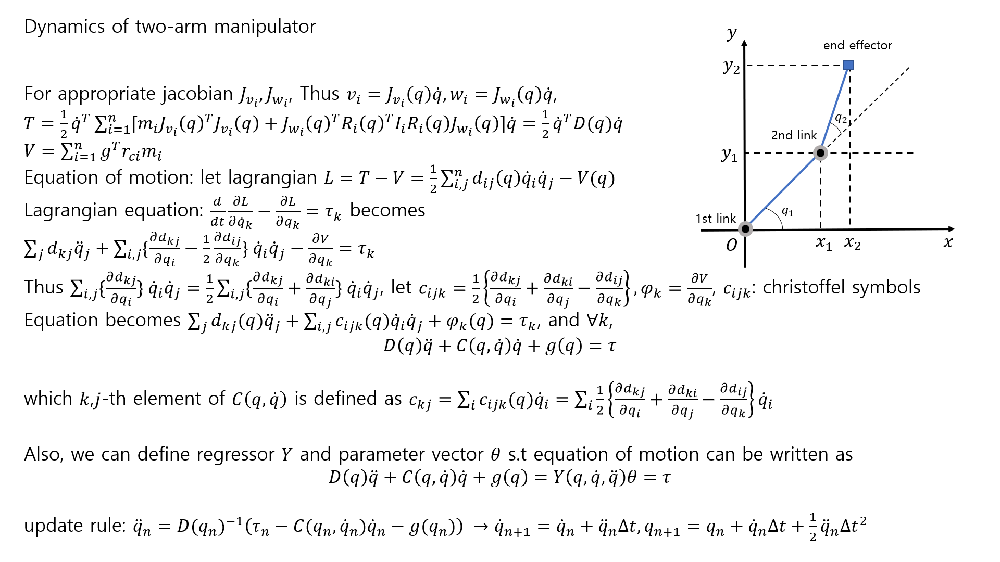
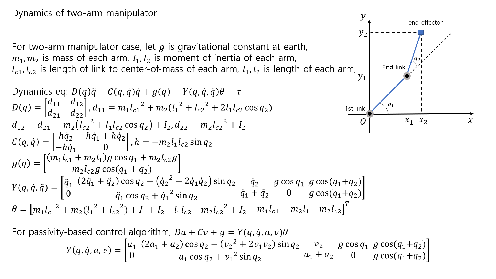
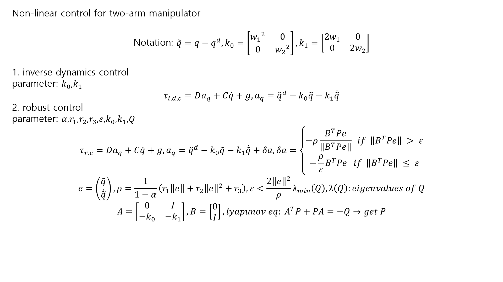
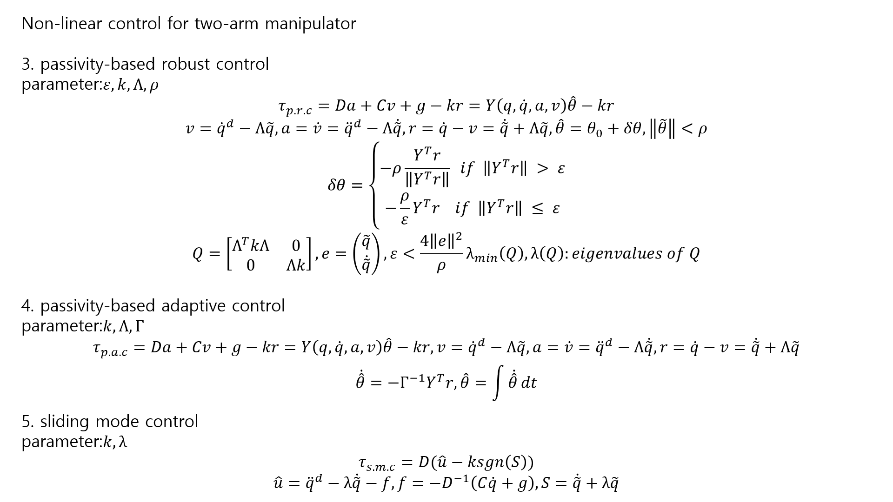
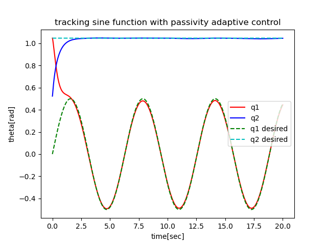
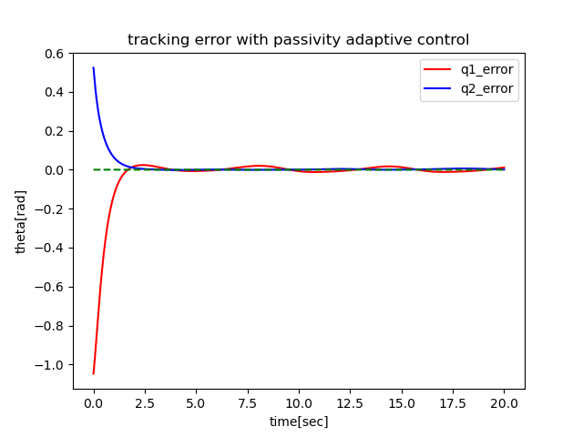
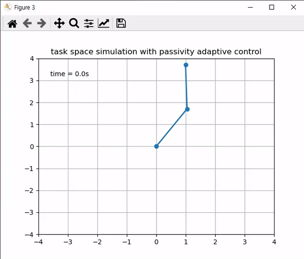

# Non-linear-control-simulator
Non-linear control algorithms(inverse dynamics control, robust control, passivity-based robust control, passivity-based adaptive control, sliding mode control) simulator for two-arm manipulator, coded by python

## Usage
Just run below command at terminal
```
git clone https://github.com/dohyeoklee/Non-linear-control-simulator
cd Non-linear-control-simulator/src
python main.py -a -c="passivity adaptive" -m="tracking sine function"
```

Dependency: 

-python 3.8.5

-numpy: 1.19.2

-matplotlib: 3.3.2

-scipy: 1.5.2

## Algorithm
### Dynamics



### Non-linear control



## Result




## Reference
[1] Robot Dynamics and Control, Second Edition, Mark W. Spong, Seth Hutchinson, and M. Vidyasagar
